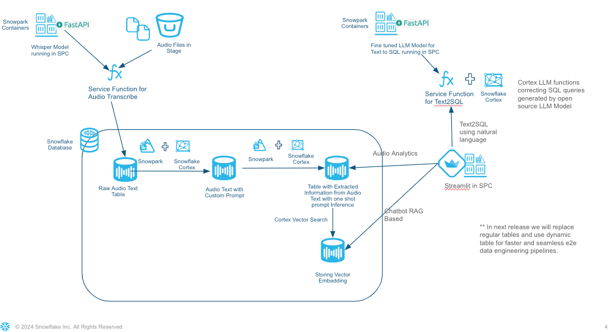

# sfguide-call-centre-analytics-with-snowflake-cortex-and-spcs

The Call Centre Analytics is solution built for analyzing insurance call center audio files. Leveraging Snowflake features like cortex, large language model running in Snowpark containers, it transcribes text and duration from audiofile,extracts essential information such as Customer details, Agent interactions, Sentiment analysis, Summary, Resolution, and Next Steps from each call to name a few. Here are key highlights and features of the solution :

- Audio-to-Text Conversion: Utilizes open AI Whisper running in Snowpark Containers to transcribe insurance call center audio files into text, facilitating for efficient analysis.
- Insight Capture: Extracts and compiles information such as Customer details, Agent interactions, Sentiment analysis, Summary, Resolution, and Next Steps, Duration , Intent for every call using Cortex LLM functions.
- Supervisor Dashboard: Builds dynamic dashboards that showcase diverse metrics, enabling users to gain a holistic view of various metrics and user experiences.
- RAG-Based Chatbot: Integrates an innovative chatbot using RAG approach, ensuring contextual responses for enhanced user engagement.
- Text2SQL Functionality: Empowers users with a personalized co-pilot like feature, allowing for natural language queries and receiving output tailored to tables in context, enhancing user experience and analytical capabilities.

## Solution Architecture

## Demo has the following features
* Whisper running in Snowpark Containers to Extract Text and Duration of the call from the audio files

* Using Cortex LLM functions for diarization to identify customer and representative

* Snowpark and Cortext LLM function to summarize and extract various information from call conversation

* Using Cortex Vector Search and Embedding to store embedding in Vector Type

* LLM model fine tuned for SQL queries running in SPCS for converting natural language to SQL Text

* Streamlit APP which has dashboard for audio analytics, chatbot on your data using RAG based approach. Also a Text2SQL interface to getting SQL queries and executing them from natural language text

## Requirements

* Account with Snowpark Container Services PuPr enabled in AWS. Go through the [documenentation](https://docs.snowflake.com/en/developer-guide/snowpark-container-services/overview) to know about the available regions.
* Docker installed
* Cortex LLM function (prpr)
* Follow [this](https://docs.snowflake.com/en/developer-guide/snowpark-container-services/tutorials/common-setup#configure-prerequisites) document for the pre-requisites required for creating services and compute pools.

## Setup Instructions

### 1. Conda setup

Run the below commands on the terminal to create a conda virtual environment and install few packages

- conda create --name demosnowparkdemo --override-channels -c https://repo.anaconda.com/pkgs/snowflake python=3.8 

- conda install snowflake-snowpark-python pandas pyarrow streamlit

<b> Update the connection.json file with your account, db, schema details </b>

### 2. Transcribing Audio Files 

a. Run the following notebook to bring up the Whisper Container for transcribing audio to text and creating other objects required for audio2text.

 [audio2text_setup_code](./audio2text/audio2text_setup_code.ipynb)

(OR)

 b. If you don't want to create the Audio2text container but load the raw conversation data directly into the raw table then run the below notebook:
 
  [audio2text_setup_onlyConversation](./audio2text/audio2text_setup_onlyConversation.ipynb)

c. Once either a or b steps are executed, run the following notebook:

[AudioAnalytics](./audio2text/AudioAnalytics.ipynb)

You can find the model card for Whisper from the following link:
 [ModelCard](https://github.com/openai/whisper/blob/main/model-card.md#model-details)

### 3. Setup Text2SQL Container

Run the following notebook to bring up the text2sql Container and creating other objects needed. 

This is required if you want the text2sql capabilities from the streamlit app. You can skip this step if you don't want to explore this feature

 [text2sql_setup_code](./text2sql/text2sql_setup_code.ipynb)

### 4. Setup Streamlit App

Run the following notebook to bring up the Snowpark container required for runnig Streamlit App and creating other objects needed. 

 [text2sql_setup_code](./streamlit/streamlit_setup_code.ipynb)

## Demo Recoding

https://github.com/snowflakecorp/CUSTOMER-INSIGHT-ANALYZER/assets/104897154/73aa5eab-ae4e-4ec4-8fd5-bf5053fa6d9e

<!-- <video src="CxInsightAnalyzer.mp4" controls title="Title"></video> -->

